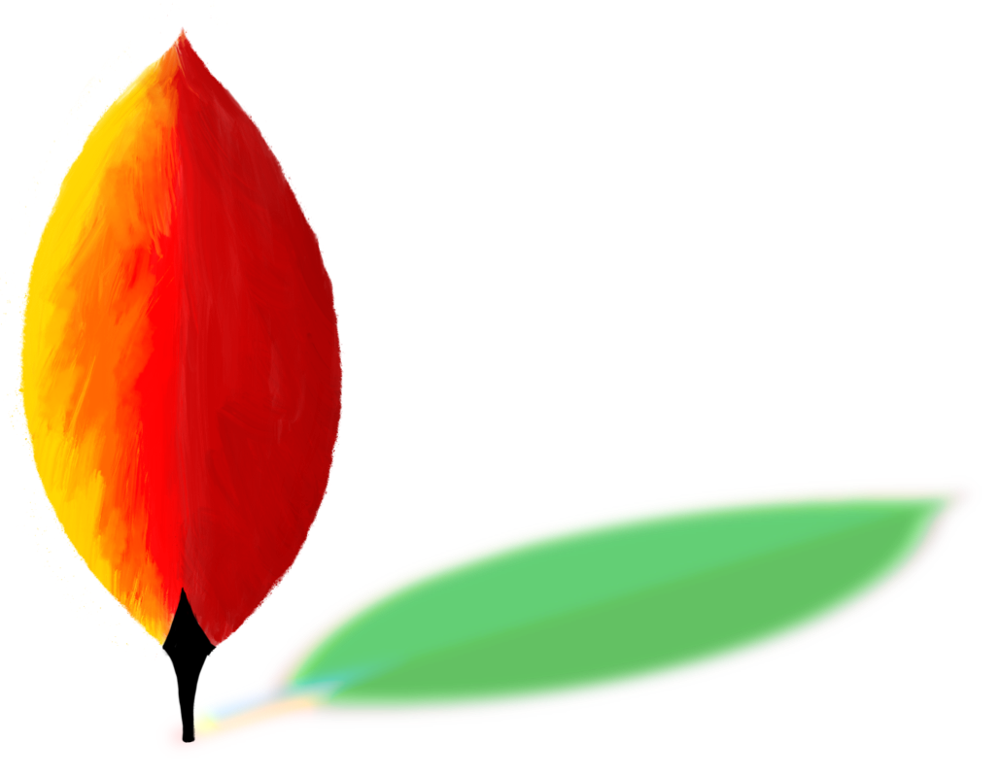

{class=mainlogo style=""}

# ZIO-MONGO

zio-mongo is a library for interacting with MongoDB in a purely functional way. It is built on top of the [ZIO](https://zio.dev) library and uses the [Java Reactive Streams Driver](http://mongodb.github.io/mongo-java-driver/) for MongoDB.

It is compatible with Scala 3 &  ZIO 2 and supports ZIO JSON and Circe codecs.

